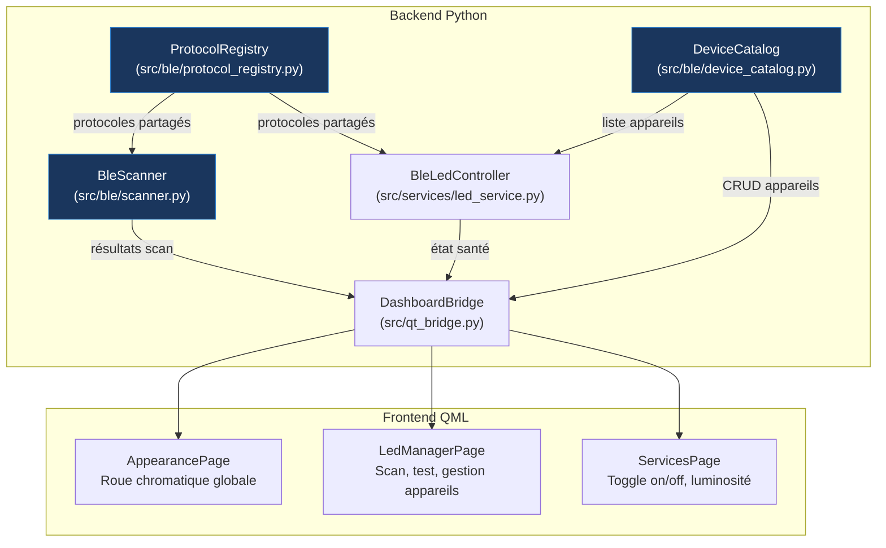

# Gestionnaire Universel d'Éclairages BLE

Remplacer le système actuel à deux emplacements figés (`Habitacle` / `Plancher`) par un gestionnaire dynamique d'appareils BLE. L'utilisateur pourra scanner, tester, nommer et organiser un nombre variable de contrôleurs LED depuis l'interface tactile, sans jamais saisir d'adresse manuellement.

## User Review Required

> [!IMPORTANT]
> **Noms prédéfinis vs saisie libre** — Le document de design note que taper un nom au clavier sera très difficile sur l'écran tactile embarqué. Le plan propose une **liste de noms prédéfinis** (« Tableau de bord », « Plancher », « Portière gauche », « Portière droite », « Console », « Coffre », « Ciel de toit », « Siège conducteur », « Siège passager ») avec possibilité de saisir un nom libre si un clavier est disponible. Est-ce suffisant ?
- je valide


> [!IMPORTANT]
> **Couleur par appareil ou couleur globale ?** — Actuellement, tous les LEDs suivent la couleur d'accent du thème. Deux options :
> - **Option A (recommandée)** : Tous les appareils suivent la couleur d'accent par défaut, mais chacun a sa propre luminosité et son propre on/off. Mode simple, cohérent avec l'UX actuelle.
> - **Option B** : Chaque appareil peut avoir une couleur fixe indépendante de l'accent. Plus flexible mais complexifie l'interface (un color picker par appareil).
- on doit pouvoir grouper ceux que l'on veux. et on peut choisir soit une couleur soit de suivre l'accent. mais a un groupe comme a un appareil seul. mais par défaut ils sont tous dans le meme groupe avec la couleur d'accent


> [!WARNING]
> **Groupes** — Le design original prévoit des groupes d'appareils. Le plan les inclut en **Phase 2** (après le cœur fonctionnel) pour ne pas surcharger la première livraison. Confirme si les groupes sont prioritaires ou peuvent attendre.

## Open Questions

> [!IMPORTANT]
> **Nombre max d'appareils** — Y a-t-il une limite pratique au nombre de bandeaux BLE dans la voiture ? (impacts sur la latence de mise à jour couleur si > 4-5 appareils connectés simultanément)
- limiton a 4 appareils max
> [!NOTE]
> **Page dédiée ou sous-page ?** — Le plan propose une **nouvelle page dédiée** `LedManagerPage.qml` accessible depuis le menu principal (route `leds`), plutôt que d'intégrer le scan/gestion dans `AppearancePage` ou `ServicesPage` qui sont déjà denses. La roue chromatique dans `AppearancePage` continuera à piloter la couleur globale.
- page dédier. de toute facon apres ce plan fini je partirai sur une refonte de l'organisation
---

## Architecture Proposée



---

## Proposed Changes

### Phase 1 — Fondations Backend

---

#### [NEW] [`__init__.py`](file:///Users/louis/PycharmProjects/CliOS/src/ble/__init__.py)

Package `src/ble/` pour regrouper toute la logique BLE partagée.

---

#### [NEW] [`protocol_registry.py`](file:///Users/louis/PycharmProjects/CliOS/src/ble/protocol_registry.py)

**Source unique de vérité** pour les protocoles BLE, partagée entre le service LED runtime et le scan tool CLI. Extraite du code dupliqué entre [`led_service.py`](file:///Users/louis/PycharmProjects/CliOS/src/services/led_service.py#L20-L34) et [`scan_ble_leds.py`](file:///Users/louis/PycharmProjects/CliOS/tools/scan_ble_leds.py#L49-L82).

```python
@dataclass(frozen=True)
class BleProtocol:
    identifier: str           # "LOTUS_9B", "LEDCAR_DMX_9B", etc.
    label: str                # "Lotus Lantern / ELK-BLEDOM 9 octets"
    witness_color: tuple[int, int, int]  # Couleur témoin pour les tests
    witness_name: str         # "ROUGE", "CYAN", etc.

class ProtocolRegistry:
    """Registre central des protocoles BLE supportés."""

    def get(identifier: str) -> BleProtocol
    def all() -> list[BleProtocol]
    def build_payloads(identifier, r, g, b, brightness, power_on) -> list[bytearray]
    def build_power_off(identifier) -> list[bytearray]
    def preferred_char_uuids() -> list[str]
    def guess_protocol_order(device_name: str) -> list[str]
```

Contenu :
- Les 5 protocoles existants (`LOTUS_9B`, `LEDCAR_DMX_9B`, `LED_LAMP_9B`, `TRIONES_7B`, `SP110E_4B`) + les 3 dialectes de test du scan tool (`LEDCAR_A_9B`, `LEDCAR_ALL_9B`, `LEDCAR_B_CLASSIC_9B`).
- La liste des UUIDs de caractéristiques GATT prioritaires.
- Les fonctions `build_payloads()` et `build_power_off()` extraites de `led_service._build_payloads()`.
- La logique `guess_protocol_order()` extraite de `scan_ble_leds.protocol_order()`.

---

#### [NEW] [`device_catalog.py`](file:///Users/louis/PycharmProjects/CliOS/src/ble/device_catalog.py)

Catalogue persistant d'appareils BLE confirmés. Stocké dans `PersistentStorage` sous la clé `services.Leds.devices`.

```python
@dataclass
class BleDevice:
    id: str                    # UUID CliOS stable (ex. "dev_a1b2c3")
    name: str                  # Nom choisi par l'utilisateur ("Tableau de bord")
    ble_address: str           # Adresse MAC (Linux) ou UUID (macOS)
    protocol: str              # Identifiant du protocole confirmé
    gatt_char_uuid: str        # UUID de la caractéristique GATT utilisée
    write_with_response: bool  # Mode d'écriture GATT
    advertised_name: str       # Nom BLE annoncé lors du scan
    enabled: bool              # On/Off individuel
    brightness: float          # 0.0 – 100.0
    last_seen: str | None      # ISO 8601 de dernière connexion

PREDEFINED_NAMES = [
    "Tableau de bord", "Plancher", "Portière gauche", "Portière droite",
    "Console centrale", "Coffre", "Ciel de toit", "Siège conducteur",
    "Siège passager", "Pédalier", "Boîte à gants",
]

class DeviceCatalog:
    def __init__(self, storage: PersistentStorage)

    def list_devices() -> list[BleDevice]
    def get_device(device_id: str) -> BleDevice | None
    def add_device(device: BleDevice) -> str   # retourne l'id
    def update_device(device_id: str, **kwargs)
    def remove_device(device_id: str)
    def enabled_devices() -> list[BleDevice]    # uniquement les actifs
    def migrate_legacy_params()                 # migration dash_*/foot_*
    def to_json() -> list[dict]                 # sérialisation pour QML
```

**Migration legacy** : Au premier chargement, si des clés `services.Leds.params.dash_mac` et `foot_mac` existent dans le storage, elles sont converties en deux entrées `BleDevice` nommées « Habitacle » et « Plancher ». Les anciennes clés sont conservées (lecture seule) pour permettre un rollback.

---

#### [NEW] [`scanner.py`](file:///Users/louis/PycharmProjects/CliOS/src/ble/scanner.py)

Moteur de scan BLE asynchrone, réutilisable depuis le service runtime et le CLI.

```python
@dataclass
class ScanResult:
    address: str
    name: str
    rssi: int
    is_candidate: bool        # Correspond aux noms connus (ELK, LEDCAR, etc.)

class BleScanner:
    """Scan BLE non-bloquant avec publication d'état."""

    async def scan(timeout: float = 5.0) -> list[ScanResult]
    async def connect_and_discover(address: str) -> list[GattCharacteristic]
    async def test_protocol(address: str, char_uuid: str,
                           protocol: str, write_response: bool) -> bool
    async def send_color(client, char_uuid, protocol, r, g, b,
                        brightness, write_response) -> bool
```

Pattern calqué sur [`DiagnosticService`](file:///Users/louis/PycharmProjects/CliOS/src/services/diagnostic_service.py) : publie `scanning: True/False`, `scan_results: [...]` et `test_state: {...}` dans le StateStore via le runtime, pour que le QML réagisse de manière réactive.

---

#### [MODIFY] [`led_service.py`](file:///Users/louis/PycharmProjects/CliOS/src/services/led_service.py)

Refactoring majeur pour utiliser le `DeviceCatalog` et le `ProtocolRegistry` :

**Supprimé :**
- Les constantes `DEFAULT_MAC_*`, `DEFAULT_*_PROTOCOL`, `SUPPORTED_PROTOCOLS`, `PREFERRED_CHAR_UUIDS`.
- Les 7 `register_param()` figés (`dash_on`, `foot_on`, `dash_mac`, `foot_mac`, etc.).
- La méthode `_build_payloads()` (déplacée dans `ProtocolRegistry`).
- La méthode `_migrate_validated_protocols()`.

**Ajouté :**
- `__init__(self, storage, catalog: DeviceCatalog, registry: ProtocolRegistry)` — injection des dépendances.
- `register_param("global_brightness", ...)` — luminosité globale (conservée dans ServicesPage).
- `_ble_worker()` itère sur `catalog.enabled_devices()` au lieu de deux MACs hardcodées.
- Connexion/déconnexion isolée par appareil : un appareil absent ne bloque pas les autres.
- `set_color(hex_color)` envoie la couleur à tous les appareils actifs, en appliquant la luminosité par appareil × luminosité globale.
- Méthodes de scan et test intégrées, déléguées au `BleScanner` sur le même event loop async.

**Conservé :**
- Le pattern threading : event loop async dédié + `asyncio.Queue` avec coalescing.
- L'héritage de `BaseService("Leds", storage)` et le `service_id`.
- Les méthodes `start()`, `stop()`, `set_color()`.
- La détection automatique de caractéristique GATT (`_resolve_write_char`), déplacée dans `BleScanner`.

---

#### [MODIFY] [`scan_ble_leds.py`](file:///Users/louis/PycharmProjects/CliOS/tools/scan_ble_leds.py)

Refactoring pour utiliser `ProtocolRegistry` et `BleScanner` au lieu de dupliquer les constantes et payloads. Le script CLI reste fonctionnel et autonome, mais délègue la construction des trames au registre partagé.

---

#### [MODIFY] [`qt_bridge.py`](file:///Users/louis/PycharmProjects/CliOS/src/qt_bridge.py)

Nouveaux `@Slot` pour le frontend :

```python
# Scan
@Slot()
def requestBleScan(self)          # Lance un scan BLE (5s timeout)

# Gestion des appareils
@Slot(result=str)
def getLedDevices(self) -> str     # JSON: liste des appareils configurés

@Slot(str, result=str)
def getBleScanResults(self) -> str # JSON: résultats du dernier scan

# Test de protocole (wizard)
@Slot(str, str, str, bool)
def testBleProtocol(self, address, char_uuid, protocol, write_response)

@Slot()
def stopBleTest(self)             # Arrête le test en cours

# CRUD appareil
@Slot(str, str, str, str, bool, str)
def addLedDevice(self, address, name, protocol, char_uuid, write_response, advertised_name)

@Slot(str)
def removeLedDevice(self, device_id)

@Slot(str, str, str)
def updateLedDevice(self, device_id, key, value)  # name, enabled, brightness
```

---

#### [MODIFY] [`main.py`](file:///Users/louis/PycharmProjects/CliOS/main.py)

- Instancier `ProtocolRegistry`, `DeviceCatalog(storage)`.
- Passer `catalog` et `registry` au constructeur de `BleLedController`.
- Appeler `catalog.migrate_legacy_params()` au démarrage.
- Passer `led_service` (ou ses sous-composants scan/catalog) au `DashboardBridge`.

---

### Phase 1 bis — Frontend : Page Gestionnaire LED

---

#### [NEW] [`LedManagerPage.qml`](file:///Users/louis/PycharmProjects/CliOS/frontend/shared_pages/LedManagerPage.qml)

Page dédiée à la gestion des éclairages BLE. Structure en deux colonnes (pattern [`DiagnosticPage.qml`](file:///Users/louis/PycharmProjects/CliOS/frontend/shared_pages/DiagnosticPage.qml)) :

**Colonne gauche (350px) — Panneau de contrôle :**

| État | Contenu affiché |
|------|----------------|
| **Vide** (aucun appareil) | Icône + « Aucun éclairage configuré » + bouton « SCANNER » |
| **Normal** | Nombre d'appareils, statut global (Tous connectés / X déconnectés), bouton « SCANNER » |
| **Scan en cours** | Animation + « Recherche en cours… » + bouton « ARRÊTER » |

**Colonne droite — Zone contextuelle :**

| État | Contenu affiché |
|------|----------------|
| **Liste appareils** | `ListView` des appareils configurés : nom, adresse courte, protocole, pastille de statut (vert/gris/rouge), toggle on/off, slider luminosité, bouton supprimer |
| **Résultats scan** | `ListView` des appareils BLE détectés : nom annoncé, adresse, RSSI (barres signal), badge « CONNU » si candidat LED, bouton « CONFIGURER › » |
| **Wizard de test** | Assistant séquentiel de test de protocole (voir ci-dessous) |

**Wizard de test de protocole (sous-vue dans la colonne droite) :**

1. **Connexion** — Affiche « Connexion à [nom]… » avec animation.
2. **Sélection caractéristique** — Si plusieurs chars GATT writable, affiche une liste à sélectionner. Si une seule, passage automatique.
3. **Test séquentiel** — Pour chaque protocole (ordonné par heuristic du nom) :
   - Affiche le nom du protocole, la couleur témoin attendue (gros rond coloré).
   - Boutons : `✓ C'EST BON` (confirme) / `SUIVANT ›` (essaye le prochain) / `✕ ARRÊTER`.
4. **Confirmation** — Protocole trouvé ! Sélection du nom dans une grille de noms prédéfinis (boutons tactiles larges, pas de clavier).
5. **Ajout** — L'appareil apparaît dans la liste avec statut « Connecté ».

---

#### [MODIFY] [`SettingsShell.qml`](file:///Users/louis/PycharmProjects/CliOS/frontend/components/SettingsShell.qml)

Ajouter la route `leds` dans `routeSources` :

```diff
 readonly property var routeSources: ({
     menu: "../shared_pages/MenuPage.qml",
     appearance: "../shared_pages/AppearancePage.qml",
     vehicle: "../shared_pages/VehiclePage.qml",
     services: "../shared_pages/ServicesPage.qml",
     system: "../shared_pages/SystemPage.qml",
     diagnostic: "../shared_pages/DiagnosticPage.qml",
-    developer: "../shared_pages/DeveloperPage.qml"
+    developer: "../shared_pages/DeveloperPage.qml",
+    leds: "../shared_pages/LedManagerPage.qml"
 })
```

---

#### [MODIFY] [`AppShell.qml`](file:///Users/louis/PycharmProjects/CliOS/frontend/components/AppShell.qml)

Ajouter `"leds"` dans la liste `routes` :

```diff
-readonly property var routes: ["home", "menu", "appearance", "vehicle", "services", "system", "diagnostic", "developer"]
+readonly property var routes: ["home", "menu", "appearance", "vehicle", "services", "system", "diagnostic", "developer", "leds"]
```

---

#### [MODIFY] [`MenuPage.qml`](file:///Users/louis/PycharmProjects/CliOS/frontend/shared_pages/MenuPage.qml)

Ajouter une entrée « ÉCLAIRAGES » dans le tableau `sections` pour naviguer vers la page LED :

```diff
 readonly property var sections: [
     { id: "appearance", number: "02", label: "APPARENCE", sub: "Thème, ambiance et couleurs du cockpit" },
     { id: "vehicle", number: "03", label: "VÉHICULE", sub: "Profil actif, capteurs et étalonnage" },
     { id: "diagnostic", number: "04", label: "DIAGNOSTIC", sub: "Codes défaut et état des calculateurs" },
     { id: "services", number: "05", label: "SERVICES", sub: "Modules et fonctions embarquées" },
-    { id: "system", number: "06", label: "SYSTÈME", sub: "Stockage, mises à jour et alimentation" }
+    { id: "system", number: "06", label: "SYSTÈME", sub: "Stockage, mises à jour et alimentation" },
+    { id: "leds", number: "07", label: "ÉCLAIRAGES", sub: "Bandeaux LED Bluetooth, scan et groupes" }
 ]
```

---

#### [MODIFY] [`AppearancePage.qml`](file:///Users/louis/PycharmProjects/CliOS/frontend/shared_pages/AppearancePage.qml)

Ajouter un bouton de lien vers la page LED Manager sous la roue chromatique, dans la carte « Couleur d'accent & LEDs » :

```qml
Button {
    Layout.fillWidth: true
    text: "GÉRER LES ÉCLAIRAGES ›"
    onClicked: root.navigateRequested("leds")
}
```

---

#### [NEW] [`UiState.qml`](file:///Users/louis/PycharmProjects/CliOS/frontend/state/UiState.qml) (modifications)

Ajouter les propriétés réactives pour le scan BLE et la liste d'appareils LED :

```qml
// LED Manager state (publié par le backend via systemState)
readonly property var ledDevices: systemState.led_devices || []
readonly property bool bleScanning: systemState.ble_scanning || false
readonly property var bleScanResults: systemState.ble_scan_results || []
readonly property var bleTestState: systemState.ble_test_state || ({})
```

---

### Phase 2 — Groupes & Perfectionnement (itération future)

---

#### Groupes d'appareils

- Modèle de données : chaque appareil possède un champ `groups: list[str]`.
- Groupe spécial `"*"` = « Tous les éclairages » (implicite, pas stocké).
- Interface : section « Groupes » en bas de `LedManagerPage`, avec possibilité de créer un groupe (nom prédéfini), d'y ajouter/retirer des appareils par drag ou toggle, et de piloter on/off + luminosité par groupe.

#### Reconnexion automatique améliorée

- Le worker BLE tente de reconnecter les appareils déconnectés toutes les 30 secondes.
- Publie un statut de santé par appareil (`connected`, `disconnected`, `error`) dans le StateStore.
- `LedManagerPage` affiche en temps réel la pastille de statut.

#### Couleur par appareil (Option B, si retenue)

- Champ `color_override: str | None` dans `BleDevice`.
- Si `None` : suit la couleur d'accent globale.
- Si défini : mini color picker dans la carte de l'appareil.

---

## Résumé des fichiers impactés

| Action | Fichier | Rôle |
|--------|---------|------|
| **NEW** | [`src/ble/__init__.py`](file:///Users/louis/PycharmProjects/CliOS/src/ble/__init__.py) | Package BLE |
| **NEW** | [`src/ble/protocol_registry.py`](file:///Users/louis/PycharmProjects/CliOS/src/ble/protocol_registry.py) | Registre de protocoles (source unique) |
| **NEW** | [`src/ble/device_catalog.py`](file:///Users/louis/PycharmProjects/CliOS/src/ble/device_catalog.py) | Catalogue persistant d'appareils |
| **NEW** | [`src/ble/scanner.py`](file:///Users/louis/PycharmProjects/CliOS/src/ble/scanner.py) | Moteur de scan BLE async |
| **MODIFY** | [`src/services/led_service.py`](file:///Users/louis/PycharmProjects/CliOS/src/services/led_service.py) | Refactoring pour utiliser catalog + registry |
| **MODIFY** | [`src/qt_bridge.py`](file:///Users/louis/PycharmProjects/CliOS/src/qt_bridge.py) | Nouveaux slots scan/CRUD |
| **MODIFY** | [`main.py`](file:///Users/louis/PycharmProjects/CliOS/main.py) | Instanciation catalog/registry, migration |
| **MODIFY** | [`tools/scan_ble_leds.py`](file:///Users/louis/PycharmProjects/CliOS/tools/scan_ble_leds.py) | Réutilise le ProtocolRegistry |
| **NEW** | [`frontend/shared_pages/LedManagerPage.qml`](file:///Users/louis/PycharmProjects/CliOS/frontend/shared_pages/LedManagerPage.qml) | Page de gestion LED complète |
| **MODIFY** | [`frontend/components/SettingsShell.qml`](file:///Users/louis/PycharmProjects/CliOS/frontend/components/SettingsShell.qml) | Ajout route `leds` |
| **MODIFY** | [`frontend/components/AppShell.qml`](file:///Users/louis/PycharmProjects/CliOS/frontend/components/AppShell.qml) | Ajout route `leds` |
| **MODIFY** | [`frontend/shared_pages/MenuPage.qml`](file:///Users/louis/PycharmProjects/CliOS/frontend/shared_pages/MenuPage.qml) | Entrée menu « ÉCLAIRAGES » |
| **MODIFY** | [`frontend/shared_pages/AppearancePage.qml`](file:///Users/louis/PycharmProjects/CliOS/frontend/shared_pages/AppearancePage.qml) | Lien vers la page LED |
| **MODIFY** | [`frontend/state/UiState.qml`](file:///Users/louis/PycharmProjects/CliOS/frontend/state/UiState.qml) | Propriétés réactives LED/scan |

---

## Verification Plan

### Automated Tests

```bash
# Tests unitaires du registre de protocoles
python -m pytest tests/test_protocol_registry.py -v

# Tests unitaires du catalogue d'appareils (CRUD, migration, persistence)
python -m pytest tests/test_device_catalog.py -v

# Tests unitaires du scanner BLE (mock Bleak, pas de matériel)
python -m pytest tests/test_ble_scanner.py -v

# Tests du service LED refactoré (routage couleur, multi-appareils)
python -m pytest tests/test_led_service.py -v

# Tests existants du scan tool (vérifier non-régression)
python -m pytest tests/test_ble_scan_tool.py -v

# Smoke test QML (vérifier que LedManagerPage.qml compile)
python -m pytest tests/test_ui_structure.py -v

# Snapshot API bridge (vérifier que les nouveaux slots sont présents)
python -m pytest tests/test_dashboard_bridge_api_snapshot.py -v

# Suite complète
python -m pytest tests/ -v
```

#### Nouveaux fichiers de test

| Fichier | Contenu |
|---------|---------|
| `tests/test_protocol_registry.py` | Vérifier que chaque protocole a une couleur témoin unique, que `build_payloads` produit les trames attendues (reprendre les assertions existantes de `test_led_service.py` et `test_ble_scan_tool.py`), que `guess_protocol_order` priorise correctement. |
| `tests/test_device_catalog.py` | CRUD complet : add/get/update/remove. Migration legacy : vérifier que les anciennes clés `dash_*`/`foot_*` produisent deux appareils nommés. Sérialisation JSON pour QML. Persistance via `MemoryStorage`. |
| `tests/test_ble_scanner.py` | Mock `BleakScanner.discover` et `BleakClient`, vérifier le filtrage des candidats, la découverte GATT, et l'envoi de trames de test. Pattern `IsolatedAsyncioTestCase` + `AsyncMock` comme dans `test_ble_scan_tool.py`. |

### Manual Verification

- **Sur Raspberry Pi** : Lancer CliOS avec `--mock`, ouvrir Menu → Éclairages, vérifier les états vide / scan / résultats / wizard.
- **Avec matériel BLE** : Scanner les bandeaux, tester le wizard de protocole, confirmer un appareil, vérifier que la couleur d'accent pilote bien le nouvel appareil.
- **Migration** : Sur une installation existante avec des réglages `dash_mac`/`foot_mac`, vérifier que la migration crée automatiquement les deux appareils.
- **Rollback** : Vérifier qu'un retour à une version antérieure retrouve les anciennes clés `dash_*`/`foot_*` intactes.
