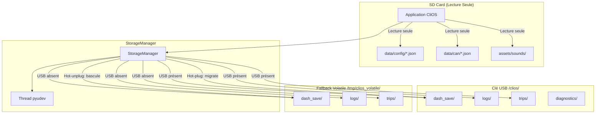
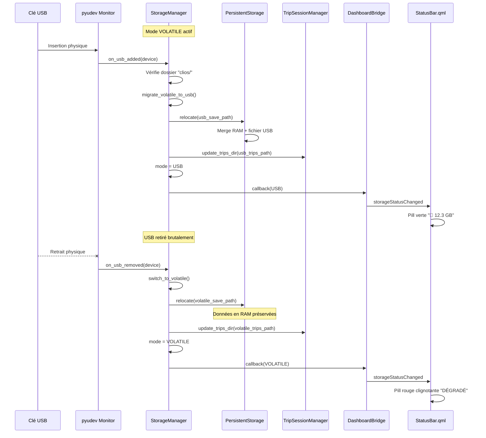

# Stockage USB Résilient — OS en Lecture Seule

## Contexte

Le Raspberry Pi 5 subit des corruptions de données lors d'extinctions forcées. La solution : passer l'OS en lecture seule et déporter **toutes les écritures** sur une clé USB contenant un dossier `clios`. En cas d'absence de clé, le système fonctionne en **mode dégradé** (données du trajet en cours en RAM uniquement, pas de persistance). Le hot-plug/unplug de la clé USB est géré sans crash.

## User Review Required

> [!IMPORTANT]
> **Choix architectural majeur** : Un nouveau module `StorageManager` centralisera la gestion du montage USB, la détection hot-plug (via `pyudev`), et l'abstraction des chemins. Tous les composants existants passeront par ce gestionnaire au lieu de construire leurs propres chemins. C'est un changement structurel profond mais propre.

> [!WARNING]
> **Impact sur `ExportService`** : Ce service scanne déjà les USB via `psutil`. Il faudra s'assurer qu'il ne confonde pas la clé USB de stockage CliOS avec une clé USB d'export. La discrimination se fera par la présence du dossier `clios/` vs le fichier `clos_export.json`.

> [!IMPORTANT]
> **Fichiers en lecture seule** : Les fichiers statiques suivants resteront sur la SD card et ne seront jamais écrits en runtime : les fichiers de configuration véhicule (`data/config/*.json`), les fichiers CAN (`data/can/*.json`), les assets audio (`assets/sounds/`). Seuls les fichiers dynamiques (save, logs, trips, profiles) seront redirigés vers la clé USB. **Est-ce bien le comportement souhaité ?** Si tu veux aussi pouvoir modifier la config véhicule en runtime (ex: calibration de vitesses), il faudra aussi rediriger `data/config/` vers la clé USB.

## Open Questions

> [!IMPORTANT]
> **1. Point de montage USB** : Sur le Pi, les clés USB sont typiquement montées sous `/media/<user>/` ou `/mnt/`. Quel est le point de montage actuel de tes clés USB ? Le système utilisera `pyudev` pour détecter automatiquement les block devices USB, mais il faut connaître le chemin de montage attendu ou si tu utilises `udev` avec auto-mount.
> Quand je branche une clé USB, elle est montée automatiquement sous `/media/clios/<nom_de_la_clé>/`. Le nom de la clé peut varier selon le volume. et clios est le nom du raspberry

> [!IMPORTANT]
> **2. Fichiers de configuration (`profiles.json`, configs véhicule)** : Le `GearCalibrationService` écrit directement dans les fichiers de config véhicule (`data/config/config_clio3diesel.json`). Le `ProfileManager` écrit dans `profiles.json`. En OS lecture seule, ces écritures échoueront. Deux options :
> - **Option A** : Rediriger aussi `data/config/` vers la clé USB (implique de copier les configs sur la clé au premier branchement)
> - **Option B** : Interdire la modification des configs en mode lecture seule (la calibration et les changements de profil seront désactivés)
> 
> Quelle option préfères-tu ?
> On part sur l'option A pour la flexibilité et la propreté.

> [!IMPORTANT]
> **3. Dépendance `pyudev`** : Le hot-plug USB sera géré via `pyudev` (wrapper Linux pour udev). C'est la méthode la plus fiable sur Pi. Il faudra l'ajouter à `requirements.txt`. Es-tu OK avec cette dépendance ?
> pas de soucis on peut l'ajouter au requirements.txt
## Proposed Changes

Les changements sont organisés en 5 composants logiques, présentés dans l'ordre de dépendance.

---

### Composant 1 — `StorageManager` (Nouveau module central)

Le cœur de l'architecture. Un module qui abstrait **où** les données sont stockées.

#### [NEW] [storage_manager.py](file:///Users/louis/PycharmProjects/CliOS/src/storage_manager.py)

Nouveau module `StorageManager` — singleton thread-safe responsable de :

**Responsabilités :**
1. **Détection USB** : Surveille les événements udev (`add`/`remove`) pour détecter le branchement/débranchement d'une clé USB
2. **Validation** : Vérifie la présence d'un dossier `clios/` à la racine du volume monté
3. **Abstraction des chemins** : Fournit des méthodes pour résoudre les chemins dynamiques (save, logs, trips, etc.) vers le bon emplacement (USB ou RAM fallback)
4. **Gestion du mode dégradé** : Quand pas de clé, fournit un répertoire tmpfs en RAM (`/tmp/clios_volatile/`) pour les écritures non-critiques
5. **Migration transparente** : Quand une clé est branchée en cours de fonctionnement, migre les données volatiles vers la clé
6. **Callbacks** : Notifie les composants intéressés lors des transitions USB connecté ↔ déconnecté
7. **État observable** : Expose l'état USB (connecté/déconnecté, point de montage, espace libre) pour l'UI

```python
class StorageMode(Enum):
    USB = "USB"           # Stockage normal sur clé USB
    VOLATILE = "VOLATILE" # Mode dégradé, RAM tmpfs

class StorageManager:
    """Gestionnaire centralisé du stockage résilient CliOS."""
    
    def __init__(self, base_dir: str, usb_folder_name: str = "clios"):
        self._base_dir = base_dir          # Répertoire d'installation CliOS (SD card, lecture seule)
        self._usb_folder_name = usb_folder_name
        self._mode = StorageMode.VOLATILE
        self._usb_root = None              # Ex: /media/pi/USBKEY/clios
        self._volatile_root = "/tmp/clios_volatile"
        self._lock = threading.RLock()
        self._callbacks: list[Callable] = []
        self._monitor_thread = None
        self._stop_event = threading.Event()
        
    # --- Résolution des chemins ---
    def get_writable_root(self) -> str:
        """Retourne la racine d'écriture active (USB ou volatile)."""
        
    def resolve_path(self, relative_path: str) -> str:
        """Résout un chemin relatif vers le stockage actif.
        Ex: resolve_path("dash_save/save.json") -> "/media/pi/USB/clios/dash_save/save.json"
        ou  resolve_path("dash_save/save.json") -> "/tmp/clios_volatile/dash_save/save.json"
        """
        
    def resolve_static_path(self, relative_path: str) -> str:
        """Résout un chemin vers la SD card (lecture seule). 
        Pour les configs, CAN, assets qui ne changent pas."""
        
    # --- Gestion du cycle de vie USB ---
    def start_monitoring(self):
        """Lance le thread de surveillance udev."""
        
    def stop_monitoring(self):
        """Arrête proprement la surveillance."""
        
    def _scan_existing_usb(self):
        """Scan initial des volumes montés au démarrage."""
        
    def _on_usb_added(self, device):
        """Callback udev : nouveau volume détecté."""
        
    def _on_usb_removed(self, device):
        """Callback udev : volume retiré."""
        
    def _migrate_volatile_to_usb(self, usb_path: str):
        """Copie les données tmpfs vers la clé USB fraîchement branchée."""
        
    def _switch_to_volatile(self):
        """Bascule en mode dégradé quand la clé est retirée."""
        
    # --- État observable ---
    @property
    def mode(self) -> StorageMode: ...
    
    @property
    def is_usb_available(self) -> bool: ...
    
    @property
    def usb_free_space_mb(self) -> float: ...
    
    def get_status(self) -> dict:
        """Retourne l'état pour l'UI : mode, espace libre, point de montage..."""
        
    # --- Callbacks ---
    def register_callback(self, callback: Callable[[StorageMode], None]):
        """Enregistre un callback appelé lors des changements de mode."""
```

**Structure du dossier `clios/` sur la clé USB :**
```
USB:/clios/
├── dash_save/          # Fichiers de sauvegarde PersistentStorage
│   ├── save.json
│   ├── save_clio3diesel.json
│   └── save_mock.json
├── logs/               # Logs rotatifs JSONL + crash traces
│   ├── clios.log.jsonl
│   └── fatal_tracebacks.log
├── trips/              # Résumés de trajets
│   └── trip_20260818_143022.json
├── trips_mock/         # Trajets en mode simulation
├── config/             # (Optionnel, si Option A choisie)
│   ├── profiles.json
│   └── ...
└── diagnostics/        # Bundles de diagnostic
    └── diag_bundle_*.zip
```

**Fallback volatile (`/tmp/clios_volatile/`) :**
- Même structure mais en tmpfs (RAM)
- Les données ne survivent pas à un reboot — c'est le but
- Seul le trajet en cours est en mémoire, ce qui est acceptable

---

### Composant 2 — Adaptation de `PersistentStorage`

#### [MODIFY] [storage.py](file:///Users/louis/PycharmProjects/CliOS/src/storage.py)

Modifications pour rendre `PersistentStorage` résilient au débranchement USB :

1. **Écriture tolérante aux erreurs** : `_save_locked()` catch les `OSError` (USB retiré) et bascule en mode dégradé sans crash — les données restent en RAM
2. **Rechargement du fichier** : Nouvelle méthode `relocate(new_filepath)` permettant de basculer le fichier de sauvegarde vers un nouveau chemin (USB → volatile ou volatile → USB) en cours d'exécution
3. **Fusion intelligente** : Lors d'un `relocate()` vers USB, les données en RAM (potentiellement plus récentes) sont mergées avec ce qui existe déjà sur la clé

```diff
 class PersistentStorage:
+    def relocate(self, new_filepath: str):
+        """Déplace le stockage vers un nouveau chemin sans perdre les données en mémoire."""
+        with self._lock:
+            # Merge: données en RAM + données existantes sur la nouvelle cible
+            self.filepath = new_filepath
+            os.makedirs(os.path.dirname(self.filepath), exist_ok=True)
+            self._save_locked()
+            self._dirty = False
 
     def _save_locked(self):
-        tmp_path = self.filepath + ".tmp"
-        with open(tmp_path, 'w') as f:
-            json.dump(self.data, f, indent=4)
-        os.replace(tmp_path, self.filepath)
+        try:
+            tmp_path = self.filepath + ".tmp"
+            with open(tmp_path, 'w') as f:
+                json.dump(self.data, f, indent=4)
+            os.replace(tmp_path, self.filepath)
+            self._write_healthy = True
+        except OSError as e:
+            if self._write_healthy:
+                self.logger.error(f"Écriture impossible: {e}")
+                self._write_healthy = False
+            # Les données restent en RAM, pas de crash
```

---

### Composant 3 — Adaptation du `main.py` et des initialisations

#### [MODIFY] [main.py](file:///Users/louis/PycharmProjects/CliOS/main.py)

Le flow de démarrage change fondamentalement :

1. **Création du `StorageManager`** avant tout le reste
2. **Résolution dynamique** de tous les chemins via `StorageManager` au lieu de `os.path.join(BASE_DIR, "data", ...)`
3. **Enregistrement du callback** de migration sur `PersistentStorage` et `TripSessionManager`
4. **Passage du `StorageManager`** au `DashboardBridge` pour l'exposition à l'UI

```diff
 def main():
     # --- 1. Arguments & Environnement ---
     ...
     BASE_DIR = os.path.dirname(os.path.abspath(__file__))
-    STORAGE_DIR = os.path.join(BASE_DIR, "data")
-    LOG_DIR = os.path.join(STORAGE_DIR, "logs")
+    
+    # Initialisation du gestionnaire de stockage résilient
+    from src.storage_manager import StorageManager
+    storage_mgr = StorageManager(BASE_DIR)
+    storage_mgr.start_monitoring()
+    
+    # Chemins statiques (SD card, lecture seule)
+    STATIC_DATA_DIR = os.path.join(BASE_DIR, "data")
+    CAN_DIR = os.path.join(STATIC_DATA_DIR, "can")
+    CONFIG_DIR = storage_mgr.resolve_config_dir(STATIC_DATA_DIR)
+    ENGINE_DIR = os.path.join(BASE_DIR, "assets", "sounds", "engine")
+    
+    # Chemins dynamiques (USB ou volatile)
+    LOG_DIR = storage_mgr.resolve_path("logs")
+    SAVE_DASH_DIR = storage_mgr.resolve_path("dash_save")
+    TRIPS_DIR = storage_mgr.resolve_path("trips" if not args.mock else "trips_mock")

     init_logging(LOG_DIR, level=args.log_level, console_level="WARNING")
     install_crash_hooks(LOG_DIR)
     ...
```

**Enregistrement du callback de basculement USB :**
```python
def on_storage_mode_changed(new_mode):
    """Callback appelé quand l'USB est branchée/débranchée."""
    new_save_path = storage_mgr.resolve_path(
        os.path.join("dash_save", profile_manager.active_info.get("save_file", "save.json"))
    )
    storage.relocate(new_save_path)
    # Mise à jour du répertoire des trips
    session_manager.update_trips_dir(storage_mgr.resolve_path(folder_name))

storage_mgr.register_callback(on_storage_mode_changed)
```

---

### Composant 4 — Adaptation des services qui écrivent sur disque

#### [MODIFY] [trip_session_manager.py](file:///Users/louis/PycharmProjects/CliOS/src/services/trip_session_manager.py)

1. **Écriture tolérante** : `_save_trip_summary()` catch les `OSError` et ne crash plus
2. **Nouveau `update_trips_dir()`** : Permet de changer le répertoire de sortie à chaud (hot-plug USB)
3. **Mode dégradé** : Si l'écriture échoue, le trajet reste en RAM (trace consultable dans l'UI)

```diff
 class TripSessionManager(BaseService):
-    def __init__(self, api, storage, stats_service, trips_dir):
+    def __init__(self, api, storage, stats_service, trips_dir, storage_manager=None):
         ...
         self.trips_dir = trips_dir
-        os.makedirs(self.trips_dir, exist_ok=True)
+        self._storage_manager = storage_manager
+        self._ensure_trips_dir()
+        
+    def _ensure_trips_dir(self):
+        try:
+            os.makedirs(self.trips_dir, exist_ok=True)
+        except OSError:
+            self.set_warning("Répertoire trips inaccessible")
+
+    def update_trips_dir(self, new_dir: str):
+        """Hot-switch du répertoire de sauvegarde des trajets."""
+        with threading.Lock():
+            self.trips_dir = new_dir
+            self._ensure_trips_dir()
```

#### [MODIFY] [logging_runtime.py](file:///Users/louis/PycharmProjects/CliOS/src/logging_runtime.py)

1. **Écriture tolérante** : Le `RotatingFileHandler` est wrappé dans un handler résilient qui catch les `OSError` sans crash
2. **Relocation** : Nouvelle fonction `relocate_log_dir(new_dir)` pour basculer les logs vers USB quand elle est branchée

```diff
+class ResilientFileHandler(logging.handlers.RotatingFileHandler):
+    """RotatingFileHandler qui ne crash pas si le support est retiré."""
+    def emit(self, record):
+        try:
+            super().emit(record)
+        except OSError:
+            pass  # Le log est perdu mais l'app ne crash pas
```

#### [MODIFY] [crash_hooks.py](file:///Users/louis/PycharmProjects/CliOS/src/crash_hooks.py)

1. **Écriture tolérante** : `faulthandler.enable()` avec fallback sur `sys.stderr` si le fichier n'est pas accessible

#### [MODIFY] [export_service.py](file:///Users/louis/PycharmProjects/CliOS/src/services/export_service.py)

1. **Discrimination USB** : Ajouter un filtre pour ignorer la clé USB qui contient le dossier `clios/` (c'est la clé de stockage, pas d'export)
2. **Mode dégradé** : Le service d'export est désactivé automatiquement si aucune clé d'export n'est trouvée (comportement actuel préservé)

```diff
     def _check_usb_drives(self):
         ...
         for p in partitions:
+            # Ignore la clé USB de stockage CliOS
+            if os.path.isdir(os.path.join(p.mountpoint, "clios")):
+                continue
             ...
```

#### [MODIFY] [profile_manager.py](file:///Users/louis/PycharmProjects/CliOS/src/profile_manager.py)

1. **Écriture tolérante** : `save()` catch les `OSError` si le filesystem est en lecture seule
2. **Résolution dynamique du `save_dash_dir`** : Accepte un callback ou reference au `StorageManager` pour résoudre `get_save_path()` dynamiquement

#### [MODIFY] [qt_bridge.py](file:///Users/louis/PycharmProjects/CliOS/src/qt_bridge.py)

1. **Écriture config tolérante** : `save_setting()` catch `OSError` et notifie l'utilisateur que la modification est temporaire (en RAM seulement)
2. **Exposition du `StorageManager`** : Nouveau slot/property `storageStatus` pour l'UI
3. **Export diagnostic** : Résout `output_dir` via `StorageManager`

```diff
 class DashboardBridge(QObject):
+    storageStatusChanged = Signal()
     
     def __init__(self, api, config_path, orchestrator, ..., 
+                 storage_manager=None):
         ...
+        self._storage_manager = storage_manager
+        
+    @Property('QVariant', notify=storageStatusChanged)
+    def storageStatus(self):
+        if self._storage_manager:
+            return self._storage_manager.get_status()
+        return {"mode": "UNKNOWN", "usb_connected": False}
```

---

### Composant 5 — Indicateur USB dans l'interface QML

#### [MODIFY] [StatusBar.qml](file:///Users/louis/PycharmProjects/CliOS/frontend/components/StatusBar.qml)

Ajout d'un indicateur USB permanent dans la barre de statut, à gauche des pills de santé des services :

- **USB connectée** : Icône USB verte + espace libre affiché (ex: `💾 12.3 GB`)
- **USB déconnectée** : Icône USB rouge clignotante + texte `MODE DÉGRADÉ`
- Le tout suit le pattern visuel existant (pills arrondies avec border colorée)

```qml
// Indicateur de stockage USB (toujours visible)
Rectangle {
    width: usbContent.width + 30
    height: 28
    radius: 14
    
    property var usbStatus: bridge && bridge.storageStatus ? bridge.storageStatus : {}
    property bool usbOk: usbStatus.usb_connected === true
    
    color: usbOk ? Qt.rgba(0.0, 1.0, 0.0, 0.1) : Qt.rgba(1.0, 0.0, 0.0, 0.1)
    border.color: usbOk ? "#00ff00" : "#ff0000"
    border.width: 1
    
    // Clignotement si déconnecté
    SequentialAnimation on opacity {
        running: !usbOk
        loops: Animation.Infinite
        NumberAnimation { to: 0.4; duration: 600 }
        NumberAnimation { to: 1.0; duration: 600 }
    }
    
    Row {
        id: usbContent
        anchors.centerIn: parent
        spacing: 6
        Text {
            text: "💾"
            font.pixelSize: 14
        }
        Text {
            text: usbOk 
                ? (usbStatus.free_space_mb > 1024 
                    ? (usbStatus.free_space_mb / 1024).toFixed(1) + " GB"
                    : Math.round(usbStatus.free_space_mb) + " MB")
                : "DÉGRADÉ"
            color: usbOk ? "#00ff00" : "#ff0000"
            font.pixelSize: 12
            font.bold: true
        }
    }
}
```

#### [MODIFY] [InfoPage.qml](file:///Users/louis/PycharmProjects/CliOS/frontend/pages/InfoPage.qml)

Ajout d'une section "Stockage" dans la page d'informations système montrant :
- Mode actuel (USB / Dégradé)
- Point de montage USB
- Espace libre/total
- Nombre de trajets sauvegardés

---

### Composant 6 — `UsbStorageService` (Nouveau service orchestré)

#### [NEW] [usb_storage_service.py](file:///Users/louis/PycharmProjects/CliOS/src/services/usb_storage_service.py)

Un `BaseService` dédié qui encapsule le `StorageManager` dans le framework de services existant. Cela permet :
- D'afficher l'état USB dans la page Services avec les mêmes pills que les autres services
- De bénéficier du système de health existant (OK/WARNING/ERROR)
- D'avoir des paramètres configurables (intervalle de scan, etc.)

```python
class UsbStorageService(BaseService):
    """Service de surveillance du stockage USB résilient."""
    
    def __init__(self, api, storage, storage_manager):
        super().__init__("USB_Storage", storage)
        self._storage_manager = storage_manager
        
    def start(self, stop_event):
        super().start(stop_event, implemented=True)
        threading.Thread(target=self._run, args=(stop_event,), daemon=True).start()
        
    def _run(self, stop_event):
        while not stop_event.is_set():
            status = self._storage_manager.get_status()
            
            if status["usb_connected"]:
                free_mb = status.get("free_space_mb", 0)
                if free_mb < 100:
                    self.set_warning(f"Espace faible: {free_mb:.0f} MB restants")
                else:
                    self.set_ok(f"USB OK — {free_mb:.0f} MB libres")
            else:
                self.set_warning("Mode dégradé — Pas de clé USB")
                
            # Expose les infos de stockage dans l'API pour l'UI
            self.api.update({
                "storage_mode": status["mode"],
                "storage_usb_connected": status["usb_connected"],
                "storage_free_mb": status.get("free_space_mb", 0),
                "storage_mount": status.get("mount_point", ""),
            })
            
            stop_event.wait(5.0)
```

---

## Diagramme d'Architecture



---

## Diagramme de séquence — Hot-plug USB



---

## Résumé des fichiers impactés

| Fichier | Action | Criticité |
|---|---|---|
| [`storage_manager.py`](file:///Users/louis/PycharmProjects/CliOS/src/storage_manager.py) | **[NEW]** Module central | 🔴 Critique |
| [`usb_storage_service.py`](file:///Users/louis/PycharmProjects/CliOS/src/services/usb_storage_service.py) | **[NEW]** Service orchestré | 🟡 Moyen |
| [`storage.py`](file:///Users/louis/PycharmProjects/CliOS/src/storage.py) | **[MODIFY]** Résilience + relocate | 🔴 Critique |
| [`main.py`](file:///Users/louis/PycharmProjects/CliOS/main.py) | **[MODIFY]** Refonte init chemins | 🔴 Critique |
| [`qt_bridge.py`](file:///Users/louis/PycharmProjects/CliOS/src/qt_bridge.py) | **[MODIFY]** Exposition USB status | 🟡 Moyen |
| [`trip_session_manager.py`](file:///Users/louis/PycharmProjects/CliOS/src/services/trip_session_manager.py) | **[MODIFY]** Hot-switch trips dir | 🟡 Moyen |
| [`logging_runtime.py`](file:///Users/louis/PycharmProjects/CliOS/src/logging_runtime.py) | **[MODIFY]** Handler résilient | 🟡 Moyen |
| [`crash_hooks.py`](file:///Users/louis/PycharmProjects/CliOS/src/crash_hooks.py) | **[MODIFY]** Fallback stderr | 🟢 Faible |
| [`export_service.py`](file:///Users/louis/PycharmProjects/CliOS/src/services/export_service.py) | **[MODIFY]** Discrimination USB | 🟢 Faible |
| [`profile_manager.py`](file:///Users/louis/PycharmProjects/CliOS/src/profile_manager.py) | **[MODIFY]** Écriture tolérante | 🟡 Moyen |
| [`StatusBar.qml`](file:///Users/louis/PycharmProjects/CliOS/frontend/components/StatusBar.qml) | **[MODIFY]** Indicateur USB | 🟡 Moyen |
| [`InfoPage.qml`](file:///Users/louis/PycharmProjects/CliOS/frontend/pages/InfoPage.qml) | **[MODIFY]** Section stockage | 🟢 Faible |

---

## Verification Plan

### Tests automatisés
```bash
# Test unitaire du StorageManager (mode volatile, mode USB, transitions)
python -m pytest tests/test_storage_manager.py -v

# Test unitaire du PersistentStorage résilient (relocate, erreurs d'écriture)
python -m pytest tests/test_storage_resilient.py -v

# Test d'intégration : démarrage sans USB
python main.py --mock --ui cli
# Vérifier que l'app démarre en mode dégradé sans erreur
```

### Vérification manuelle
1. **Démarrage sans clé USB** : L'app démarre normalement, StatusBar affiche "DÉGRADÉ" en rouge clignotant, les données sont en RAM
2. **Branchement à chaud** : Insérer une clé USB avec un dossier `clios/` → l'indicateur passe au vert, les données volatiles sont migrées
3. **Débranchement à chaud** : Retirer la clé → l'indicateur repasse au rouge, l'app continue sans crash
4. **Extinction forcée en mode volatile** : L'app redémarre proprement (OS en lecture seule protège le système)
5. **Extinction forcée avec USB** : Au pire la clé est corrompue, le Pi redémarre proprement, et une nouvelle clé peut être insérée
