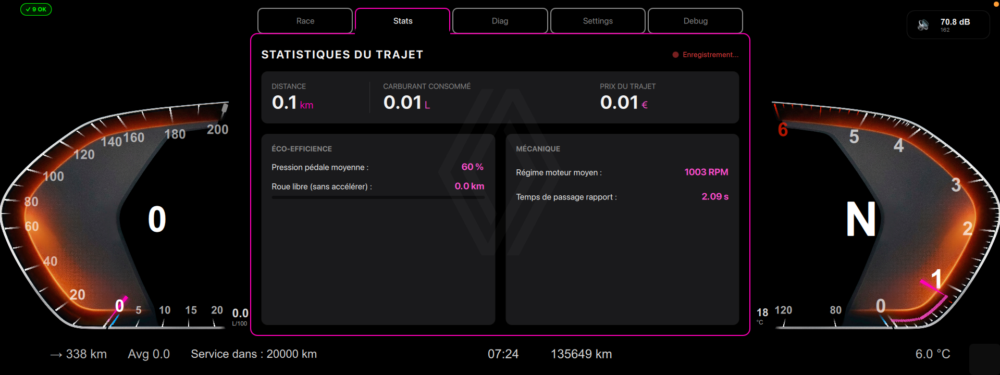

# CliOS


ClOS est un tableau de bord automobile modulaire en Python/PySide6, conçu pour fonctionner sur Raspberry Pi ou sur poste de développement.

## Aperçu de l'interface QML


## Objectif

Le projet centralise la télémétrie véhicule (CAN/OBD), les services embarqués (session, diagnostics, monitoring) et une interface QML temps réel.

## Fonctionnalités principales

- Lecture CAN via `python-can` (SocketCAN) avec décodage de signaux.
- Diagnostic OBD (scan de défauts) intégré au bus CAN.
- Interface QML (PySide6) avec pages de conduite, services et réglages.
- Gestion de session trajet (pause/reprise/fin) et export de synthèse.
- Calculs de statistiques trajet (distance, consommation, coût, maintenance).
- Services optionnels: son moteur, LED BLE, monitoring système.
- Mode simulation (`--mock`) pour développer sans véhicule.

## Architecture

- `main.py`: point d'entrée, initialisation des services et lancement UI/CLI.
- `src/api.py`: état partagé thread-safe entre services et interface.
- `src/orchestrator.py`: cycle de vie des services (start/stop, health).
- `src/services/`: services métiers (CAN, diag, stats, puissance, etc.).
- `src/qt_bridge.py`: pont Qt entre backend Python et frontend QML.
- `frontend/`: interface QML (vues, pages, composants).
- `data/`: profils véhicule, configuration, sauvegardes et trajets.

## Logging et diagnostic

Le projet inclut un système de logs asynchrone à faible overhead:

- fichier JSONL rotatif: `data/logs/clios.log.jsonl`
- trace fatale: `data/logs/fatal_tracebacks.log`
- buffer mémoire des derniers événements (consultable depuis l'UI)
- hooks globaux (`sys.excepthook`, `threading.excepthook`, `faulthandler`)
- export d'un bundle de diagnostic depuis la page Journal système

## Installation

```bash
cd /path/to/CliOS
python3 -m pip install -r requirements.txt
```

## Lancement

### Interface graphique (véhicule réel)

```bash
python3 -u main.py --ui gui
```

### Interface graphique (simulation)

```bash
python3 -u main.py --ui gui --mock
```

### Interface CLI

```bash
python3 -u main.py --ui cli --mock
```

### Options utiles

```bash
# Niveau de logs
python3 -u main.py --ui gui --mock --log-level DEBUG

# Autoriser une version PySide6 non recommandée
python3 -u main.py --ui gui --mock --allow-unsupported-pyside
```

## Données et profils

- profils: `data/config/profiles.json`
- configurations véhicule: `data/config/*.json`
- définitions CAN: `data/can/*.json`
- sauvegardes dashboard: `data/dash_save/*.json`
- exports trajets: `data/trips*/trip_*.json`

## Export USB (mode autonome)

Le service `Export` scanne périodiquement les périphériques montés et déclenche un export quand il trouve un fichier `clos_export.json` à la racine de la clé USB.

### 1) Préparer la clé USB

1. Brancher la clé USB.
2. Créer un fichier `clos_export.json` à la racine de la clé.
3. Mettre un contenu JSON valide, par exemple:

```json
{
  "target_folder": "ClOS_Exports"
}
```

`target_folder` est optionnel (défaut: `ClOS_Exports`).

### 2) Ce qui est exporté

- Le service parcourt le `data_dir` configuré côté backend.
- Seuls les fichiers `.json` sont copiés.
- La copie est atomique (`.tmp` puis renommage) pour éviter les fichiers partiels.
- Si l'option `delete_after` est activée dans l'UI, la source locale est supprimée après copie.

### 3) Politique de ré-export

- Par défaut: export uniquement si le fichier a changé (signature `nom|taille|mtime_ns`).
- Action manuelle possible dans la page Services: bouton `Ré-exporter tout` (paramètre `reexport_all`).

### 4) Historique d'export (important)

Deux historiques sont conservés:

- Historique local (persisté dans le save profil):
  - clé: `services.Export.history_v2`
  - emplacement physique: `data/dash_save/*.json` (profil actif)
- Historique sur clé USB:
  - fichier: `.clios_export_history.json`
  - emplacement: `<target_folder>/.clios_export_history.json`

Ces historiques évitent les doublons et permettent de reprendre proprement les exports.

### 5) Dépannage rapide

- Vérifier que `clos_export.json` est bien à la racine de la clé (pas dans un sous-dossier).
- Vérifier que le JSON est valide.
- Vérifier que le service `Export` est activé dans la page Services.
- Vérifier les logs dans `data/logs/clios.log.jsonl`.

## Notes de déploiement Raspberry Pi

- utiliser des versions PySide6 homogènes (`PySide6`, `PySide6-Addons`, `PySide6-Essentials`, `shiboken6`)
- valider la disponibilité de la sortie audio avant d'activer le service son
- privilégier le mode `--mock` pour isoler l'interface pendant les tests

## Contribution

1. Créer une branche de travail.
2. Appliquer les changements avec validation locale.
3. Ouvrir une Pull Request avec une description technique claire.

## Licence

Projet distribué sous licence GPLv3 (voir [`LICENSE`](./LISCENCE).
