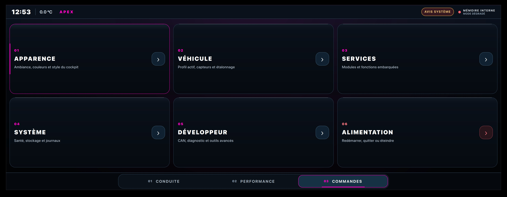

# CliOS

CliOS est un tableau de bord automobile modulaire en Python, PySide6 et QML,
destiné à un écran tactile ultra-large 1920×720 installé dans l’habitacle.
Il centralise la télémétrie CAN/OBD, les statistiques de trajet, le diagnostic,
le stockage résilient et plusieurs interfaces visuelles.
### Voici quelques captures d’écran de l’interface graphique
Apex : 



Atelier Luxe :


## Fonctionnalités

- décodage CAN via SocketCAN et définitions JSON par profil véhicule ;
- calculs moteur adaptés au profil actif, notamment puissance, couple disponible
  et charge moteur ;
- statistiques de trajet : distance, consommation, coût, autonomie,
  agressivité, décélération sans accélérateur et accélération longitudinale ;
- diagnostic OBD, monitoring système, stockage USB et export de trajets ;
- quatre styles QML : Apex, Atelier Luxe, GT Modern et Legacy Dashboard ;
- mode simulation avec `--mock`, sans véhicule connecté.

## Architecture en une phrase

Les producteurs publient des `StatePatch` dans [VehicleRuntime](src/runtime.py),
le store conserve des domaines stricts et leurs métadonnées, le bridge Qt expose
uniquement des dictionnaires structurés, puis `UiState.qml` fournit aux styles
des propriétés sémantiques prêtes à afficher.

La description détaillée se trouve dans
[docs/backend_architecture.md](docs/backend_architecture.md), et les règles de
migration dans [docs/migration_runtime.md](docs/migration_runtime.md).

## Organisation du dépôt

```text
main.py                         démarrage et composition des services
src/runtime.py                  passerelle de publication du runtime
src/state_store.py              snapshots, domaines, TTL et qualité
src/signal_catalog.py           catalogue strict des signaux CAN
src/qt_bridge.py                contrat Python/QML structuré
src/services/                  services métier et calculs dérivés
frontend/state/UiState.qml      façade sémantique consommée par les dashboards
frontend/styles/                paquets visuels indépendants
data/can/                       définitions des trames CAN
data/config/                    profils et courbes moteur
tests/                          tests backend, QML et contrats d’architecture
tools/qml_smoke.py              rendu hors écran à 1920×720
```

Le bridge ne fournit volontairement plus les anciennes propriétés plates
`data`, `stats`, `systemHealth` ou `storageStatus`. Toute nouvelle vue doit
passer par `UiState.qml`.

## Installation

### Installation rapide (Recommandée)

Clonez le dépôt puis lancez l'assistant d'installation interactif :

```bash
git clone https://github.com/VotreUser/CliOS.git
cd CliOS
./install.sh
```

L'installateur s'occupe de tout :
- Détection de l'OS et installation des paquets système indispensables (`apt`, audio, `can-utils`, `cage`).
- Création et configuration de l'environnement virtuel `.venv`.
- Compilation adaptée de la bibliothèque audio DSP `pyo`.
- Configuration optionnelle du matériel CAN (`can-usb`, `slcan`, `dfu-util`).
- Configuration optionnelle du démarrage automatique Kiosk au boot via **Cage Wayland** (`clios.service`, sans nécessiter de bureau).
- Optimisation optionnelle du démarrage rapide (Fast-Boot) pour Raspberry Pi.

#### Options de l'installateur :
```bash
./install.sh --dry-run    # Mode simulation (prévisualise sans rien modifier)
./install.sh --venv-only  # Configure uniquement Python sans privilèges sudo
./install.sh --uninstall  # Supprime les services et règles système de CliOS
```

Pour les détails d'installation manuelle et optimisations :
- [Guide installation audio Pyo](installation/guide_installation_pyo.md)
- [Guide fichiers système & matériel CAN](installation/guide_fichier_systeme.md)
- [⚡ Guide optimisation Fast-Boot Raspberry Pi 5](installation/guide_optimisation_boot_rpi5.md)

## Lancement

Utilisez le lanceur universel `./clios` (active automatiquement le `.venv`) :

```bash
# Interface graphique sur véhicule réel
./clios

# Interface graphique avec simulation (idéal pour tester sans matériel)
./clios --mock

# Interface CLI avec simulation
./clios --ui cli --mock
```

Options utiles :

```bash
./clios --mock --log-level DEBUG
./clios --mock --allow-unsupported-pyside
```

## Mise à jour

Pour mettre à jour CliOS (Git pull + dépendances Python .venv + permissions) en une commande :

```bash
./update.sh
```

*(Cette mise à jour peut également être déclenchée directement depuis l'interface tactile dans le menu Maintenance).*

## Validation locale

```bash
python3 -m compileall -q src main.py
QT_QPA_PLATFORM=offscreen python3 -m unittest discover -s tests -q
QT_QPA_PLATFORM=offscreen python3 tools/qml_smoke.py
```

Le smoke test couvre les quatre styles, leurs routes principales et les états
d’avertissement, pause, données absentes et confirmation à 1920×720.

## Données persistantes et stockage

Les profils et sauvegardes sont stockés sous `<clé USB>/clios/`. En l’absence de
clé, CliOS utilise le mode volatile configuré par `StorageManager` ; les
données sont alors perdues au redémarrage. Les trajets sont exportés sous
`trips*/trip_*.json`.

Le service `Export` détecte un fichier `clos_export.json` à la racine d’un
support USB et copie les JSON de trajets avec une signature anti-doublon.

## Contribution

Les règles de contribution et le contrat UI sont décrits dans
[CONTRIBUTING.md](CONTRIBUTING.md). Toute modification du runtime doit ajouter
ou actualiser un test de contrat si elle change un domaine, un signal, une
propriété du bridge ou une façade `UiState`.

## Licence

Projet distribué sous licence GPLv3 (voir [LICENSE](LICENSE)).
