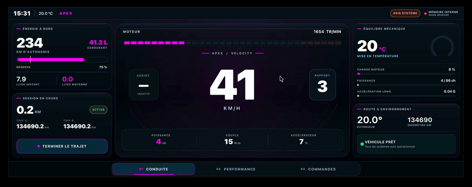
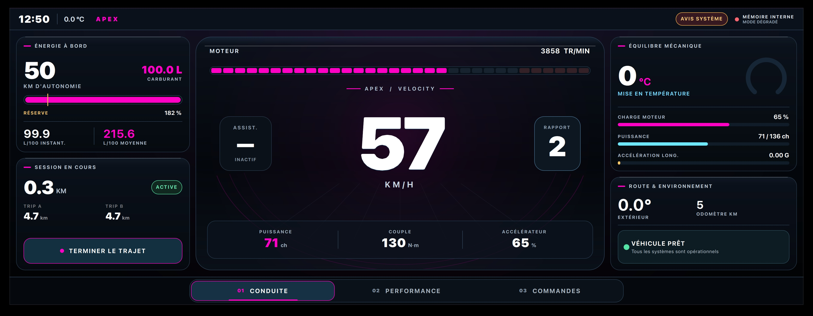
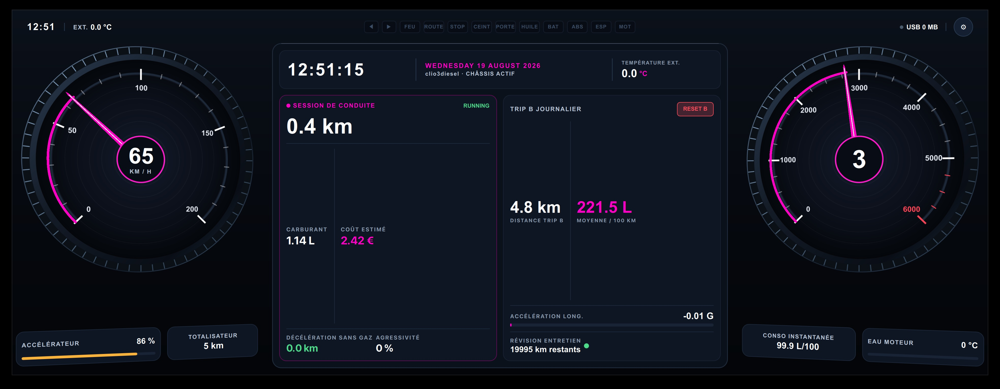

# CliOS

> CliOS 2.0 officially targets Raspberry Pi OS Bookworm 64-bit on Raspberry Pi 4/5 with a 1920×720 display. Other resolutions and desktop platforms remain experimental development targets.

<div align="center">

**Open-source, modular digital cockpit and telemetry system for vehicles.**  
*Built with Python, PySide6, QML, and SocketCAN for 1920x720 ultrawide displays.*

[](https://www.python.org/)
[](https://www.qt.io/)
[](https://github.com/cage-kiosk/cage)
[](LICENSE)

[Lire la documentation en Francais](README_FR.md) • [Issues](../../issues) • [Discussions](../../discussions)

<br/>



</div>

---

## Features

- **Real-Time CAN and OBD Telemetry**: Decodes live powertrain and chassis frames via SocketCAN and flexible JSON vehicle profiles.
- **Dynamic Powertrain Engine**: Real-time calculations of horsepower, instantaneous torque, engine load, and longitudinal G-forces.
- **Modular Multi-Theme UI (QML)**:
  - **Apex**: High-contrast, track-inspired digital cluster with live G-meter and sport telemetry.
  - **Atelier Luxe**: Minimalist design focused on cabin comfort, efficiency, and trip overview.
  - **GT Modern** and **Legacy**: Classic performance and heritage cluster layouts.
- **Trip Analytics and Auto-Export**: Automatic tracking of fuel consumption, trip cost, aggression index, and plug-and-play USB export.
- **Audio DSP and Ambient LEDs**: Real-time cabin noise filtering and engine sound design (via `pyo` DSP) with BLE ambient light sync.
- **Fail-Safe Architecture**: In-memory state store with strict TTL, domain snapshots, and volatile fallbacks.
- **Zero-Hardware Mock Mode**: Fully interactive physics and CAN simulation engine to test and develop on macOS, Linux, or Windows without a car.
- **Raspberry Pi 5 Fast-Boot**: Auto-launch into a distraction-free Wayland kiosk (`cage`) under 5 seconds.
- **Safe Releases**: SHA-256 verified staging, atomic `/opt/clios/current` activation, first-boot health checks, and automatic N-1 rollback.

## CliOS 2.x compatibility

Theme API v1 and the v1 theme, vehicle, CAN, and profile schemas remain stable throughout the 2.x series. A future incompatible contract requires a new major API version. Local themes are trusted, unsandboxed QML and are only loaded in developer mode. Python services remain statically registered and must be reviewed in this repository.

Community guides: [create a theme, adapt a vehicle, and develop a service](docs/community_en.md). Validate contributions with `python3 tools/validate_data.py --all`.

---

## Screenshots

<div align="center">

| Apex (Track and Performance) | Atelier Luxe (Comfort and Touring) |
|:---:|:---:|
|  |  |
| *High-G Telemetry & Powertrain Stats* | *Minimalist Navigation & Trip Stats* |

</div>

---

## Quickstart (Test on your PC in 30 seconds)

You do not need a vehicle or a Raspberry Pi to run CliOS. Use the built-in mock simulation:

```bash
# 1. Clone repository
git clone https://github.com/Tanchouteur/ClOS.git
cd ClOS

# 2. Run universal launcher with mock mode (auto-configures virtualenv)
./clios --mock
```

> [!TIP]
> On laptop or desktop screens with high DPI scaling, run:  
> `QT_SCALE_FACTOR=0.65 ./clios --mock` to comfortably fit the 1920x720 window.

---

## Hardware Requirements (In-Vehicle Deployment)

To deploy CliOS inside a real car, the following hardware is required:

1. **Single Board Computer**:
   - Raspberry Pi 5 (recommended) or Raspberry Pi 4 running Raspberry Pi OS 64-bit / Debian.
2. **Display**:
   - 1920x720 ultrawide display (HDMI or DSI). This is the only guaranteed layout; other formats are experimental.
3. **CAN Interface Adapter**:
   - Any SocketCAN-compatible USB or SPI adapter connected to the vehicle's CAN bus (OBD-II port or direct CAN High/Low wiring).
   - Supported adapters: **InnoMaker USB-CAN**, **CANable / CandleLight** (gs_usb), **Waveshare CAN HAT**, or **SLCAN** serial adapters (OBDLink SX, etc.).

---

## Adapting to Your Vehicle (CAN Dictionary & Profiles)

CliOS is vehicle-agnostic. To use it on your own car, you provide two JSON definition files:

### 1. The CAN Frame Dictionary (`data/can/<your_vehicle>.json`)
Defines the mapping between raw CAN IDs and signals (RPM, speed, throttle position, brake status, steering angle, coolant temperature, etc.):

```json
{
  "0x181": {
    "name": "ENGINE_DATA",
    "signals": {
      "rpm": { "start_byte": 0, "size": 2, "endian": "big", "factor": 0.125 },
      "accel_pos": { "start_byte": 3, "size": 1, "offset": -7, "factor": 0.4201 },
      "pedals": {
        "start_byte": 5,
        "bits": {
          "brake": 0,
          "clutch": 3
        }
      }
    }
  }
}
```

### 2. The Vehicle Config Profile (`data/config/<your_vehicle>.json`)
Specifies vehicle dynamics parameters used for real-time power/torque modeling:
- Engine torque/power curves
- Redline and idle RPM
- Gearbox ratios and final drive ratio
- Vehicle curb weight, frontal area, and fuel tank capacity

---

## In-Vehicle Installation (Raspberry Pi and Linux)

CliOS includes an interactive installer for Raspberry Pi OS and Debian/Ubuntu:

```bash
git clone https://github.com/Tanchouteur/ClOS.git
cd ClOS
./install.sh
```

The installer handles:
- System packages (`apt`, audio drivers, `can-utils`, `cage` Wayland compositor).
- Python virtual environment `.venv` and DSP audio compilation (`pyo`).
- CAN interface setup (`can-usb`, `slcan`, `candlelight`, `socketcan`).
- Systemd Kiosk service (`clios.service`) for instant auto-boot without a desktop environment.
- Optional Fast-Boot kernel and system tuning for Raspberry Pi 5.

#### Detailed Guides:
- [Raspberry Pi 5 Fast-Boot Optimization Guide](installation/guide_optimisation_boot_rpi5.md)
- [CAN Hardware and System Rules Guide](installation/guide_fichier_systeme.md)
- [Pyo Audio DSP Setup Guide](installation/guide_installation_pyo.md)

---

## Architecture

CliOS is designed around a strict decoupled unidirectional data flow:

```text
[ CAN Bus / OBD-II / Mock ]
            │
            ▼
     [ CanService ] ──► (Publishes StatePatch)
            │
            ▼
    [ VehicleRuntime ]
            │
            ▼
     [ StateStore ] ──► (Strict domains, TTL & quality check)
            │
            ▼
     [ Qt Bridge ] ──► (Thread-safe Python-to-QML bridge)
            │
            ▼
    [ UiState.qml ] ──► (Semantic properties consumed by Dashboards)
            │
  ┌─────────┴─────────┐
  ▼                   ▼
[ Apex QML ]   [ Atelier Luxe QML ]
```

Read the full specifications in [docs/backend_architecture.md](docs/backend_architecture.md).

---

## Repository Structure

```text
├── main.py                         # Application entrypoint and service composition
├── clios                           # Universal executable runner
├── src/
│   ├── runtime.py                  # Core event publishing gateway
│   ├── state_store.py              # Domain snapshots, TTL and quality handling
│   ├── signal_catalog.py           # Strict CAN signal registry
│   ├── qt_bridge.py                # Python/QML contract bridge
│   ├── services/                   # Business logic (telemetry, stats, audio, storage)
│   └── simulation/                 # Physics and mock CAN telemetry generators
├── frontend/
│   ├── state/UiState.qml           # Semantic UI state facade
│   └── styles/                     # QML themes (Apex, Atelier Luxe, GT Modern)
├── data/
│   ├── can/                        # Vehicle CAN DBC and frame definitions (JSON)
│   └── config/                     # Engine power curves and vehicle profiles
├── tests/                          # Backend, QML, and contract test suites
└── tools/                          # Smoke tests and developer utilities
```

---

## Contributing

Contributions are welcome. Areas of active interest:
- **Vehicle Profiles**: DBC and CAN JSON mappings for additional car models (BMW, VAG, Ford, Honda, etc.).
- **QML Themes**: Custom digital clusters, retro layouts, or specialized track displays.
- **Integrations**: Media player controls, GPS mapping, or CarPlay/Android Auto companion tools.
- **Core Optimizations**: Fast boot improvements, DSP audio processing, and BLE peripherals.

Please check [CONTRIBUTING.md](CONTRIBUTING.md) for architecture guidelines and testing procedures.

---

## License

Distributed under the **GNU General Public License v3.0** (GPLv3). See [LICENSE](LICENSE) for more details.
